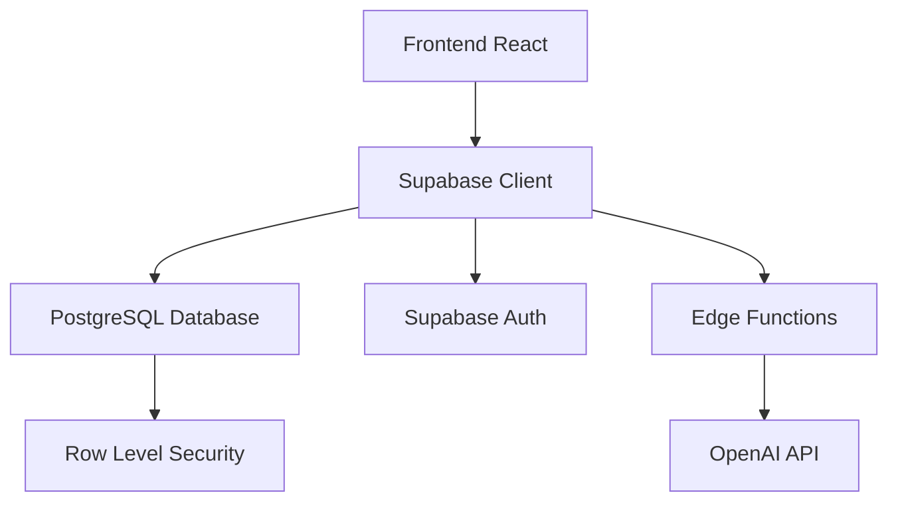

# Especificação Técnica - Dr_C Platform
## Plataforma de Biodiversidade com IA

---

## 1. Visão Geral do Projeto

### 1.1 Descrição
O Dr_C Platform é uma plataforma web de biodiversidade integrada com inteligência artificial, desenvolvida para fornecer informações, interações e gerenciamento de conteúdo relacionado à biodiversidade.

### 1.2 Tecnologias Utilizadas

**Frontend:**
- React 18.3.1
- TypeScript
- Vite (Build Tool)
- Tailwind CSS
- React Router DOM 6.30.1
- React Query (@tanstack/react-query)

**Backend:**
- Supabase (Backend-as-a-Service)
- PostgreSQL (Database)
- Row Level Security (RLS)
- Edge Functions

**UI/UX:**
- Radix UI Components
- shadcn/ui
- Lucide React Icons
- Next Themes (Dark/Light Mode)

**Autenticação:**
- Supabase Auth
- JWT Tokens
- Row Level Security

---

## 2. Arquitetura do Sistema

### 2.1 Estrutura de Diretórios

```
src/
├── components/
│   ├── ui/              # Componentes base (shadcn/ui)
│   ├── auth/            # Componentes de autenticação
│   ├── blog/            # Componentes do blog
│   ├── admin/           # Componentes administrativos
│   └── *.tsx            # Componentes gerais
├── hooks/               # Custom hooks
├── pages/               # Páginas da aplicação
├── lib/                 # Utilitários
└── integrations/        # Integrações (Supabase)
```

### 2.2 Fluxo de Dados



---

## 3. Banco de Dados

### 3.1 Esquema do Banco de Dados

#### 3.1.1 Tabela: profiles
**Propósito:** Armazenar informações adicionais dos usuários

| Campo | Tipo | Nulo | Padrão | Descrição |
|-------|------|------|---------|-----------|
| id | uuid | Não | - | ID do usuário (FK para auth.users) |
| created_at | timestamp | Não | now() | Data de criação |
| updated_at | timestamp | Não | now() | Data de atualização |
| birth_date | date | Sim | - | Data de nascimento |
| username | text | Sim | - | Nome de usuário |
| full_name | text | Sim | - | Nome completo |
| avatar_url | text | Sim | - | URL do avatar |

**Políticas RLS:**
- Users can view their own profile only
- Users can update their own profile
- Users can insert their own profile

#### 3.1.2 Tabela: user_roles
**Propósito:** Gerenciar roles/permissões dos usuários

| Campo | Tipo | Nulo | Padrão | Descrição |
|-------|------|------|---------|-----------|
| id | uuid | Não | gen_random_uuid() | ID único |
| user_id | uuid | Não | - | ID do usuário |
| role | app_role | Não | - | Role do usuário (admin, moderator, user) |
| created_at | timestamp | Não | now() | Data de criação |

**Enum app_role:** admin, moderator, user

**Políticas RLS:**
- Users can view their own roles
- Only admins can manage roles

#### 3.1.3 Tabela: conversations
**Propósito:** Armazenar conversas dos usuários com a IA

| Campo | Tipo | Nulo | Padrão | Descrição |
|-------|------|------|---------|-----------|
| id | uuid | Não | gen_random_uuid() | ID único |
| user_id | uuid | Não | - | ID do usuário |
| title | text | Não | - | Título da conversa |
| created_at | timestamp | Não | now() | Data de criação |
| updated_at | timestamp | Não | now() | Data de atualização |

**Políticas RLS:**
- Users can view their own conversations
- Users can insert their own conversations
- Users can update their own conversations
- Users can delete their own conversations

#### 3.1.4 Tabela: messages
**Propósito:** Armazenar mensagens das conversas

| Campo | Tipo | Nulo | Padrão | Descrição |
|-------|------|------|---------|-----------|
| id | uuid | Não | gen_random_uuid() | ID único |
| conversation_id | uuid | Não | - | ID da conversa |
| content | text | Não | - | Conteúdo da mensagem |
| role | text | Não | - | Role (user/assistant) |
| created_at | timestamp | Não | now() | Data de criação |

**Políticas RLS:**
- Users can view messages from their conversations
- Users can insert messages to their conversations
- Users can update messages from their conversations
- Users can delete messages from their conversations

#### 3.1.5 Tabela: blog_posts
**Propósito:** Armazenar posts do blog

| Campo | Tipo | Nulo | Padrão | Descrição |
|-------|------|------|---------|-----------|
| id | uuid | Não | gen_random_uuid() | ID único |
| user_id | uuid | Não | - | ID do autor |
| title | text | Não | - | Título do post |
| content | text | Não | - | Conteúdo do post |
| excerpt | text | Sim | - | Resumo do post |
| category | text | Não | - | Categoria |
| tags | text[] | Sim | '{}' | Tags |
| image_url | text | Sim | - | URL da imagem |
| featured | boolean | Sim | false | Post em destaque |
| views | integer | Sim | 0 | Número de visualizações |
| created_at | timestamp | Não | now() | Data de criação |
| updated_at | timestamp | Não | now() | Data de atualização |

**Políticas RLS:**
- Authenticated users can view all blog posts
- Users can create their own blog posts
- Users can update their own blog posts
- Users can delete their own blog posts

#### 3.1.6 Tabela: blog_post_comments
**Propósito:** Comentários nos posts do blog

| Campo | Tipo | Nulo | Padrão | Descrição |
|-------|------|------|---------|-----------|
| id | uuid | Não | gen_random_uuid() | ID único |
| post_id | uuid | Não | - | ID do post |
| user_id | uuid | Não | - | ID do usuário |
| content | text | Não | - | Conteúdo do comentário |
| created_at | timestamp | Não | now() | Data de criação |
| updated_at | timestamp | Não | now() | Data de atualização |

**Políticas RLS:**
- Authenticated users can view all blog post comments
- Users can create their own blog post comments
- Users can update their own blog post comments
- Users can delete their own blog post comments

#### 3.1.7 Tabela: blog_post_likes
**Propósito:** Likes nos posts do blog

| Campo | Tipo | Nulo | Padrão | Descrição |
|-------|------|------|---------|-----------|
| id | uuid | Não | gen_random_uuid() | ID único |
| post_id | uuid | Não | - | ID do post |
| user_id | uuid | Não | - | ID do usuário |
| created_at | timestamp | Não | now() | Data de criação |

**Políticas RLS:**
- Authenticated users can view all blog post likes
- Users can create their own blog post likes
- Users can delete their own blog post likes

#### 3.1.8 Tabela: posts
**Propósito:** Posts gerais da plataforma

| Campo | Tipo | Nulo | Padrão | Descrição |
|-------|------|------|---------|-----------|
| id | uuid | Não | gen_random_uuid() | ID único |
| user_id | uuid | Não | - | ID do usuário |
| content | text | Sim | - | Conteúdo do post |
| image_url | text | Sim | - | URL da imagem |
| video_url | text | Sim | - | URL do vídeo |
| created_at | timestamp | Não | now() | Data de criação |
| updated_at | timestamp | Não | now() | Data de atualização |

#### 3.1.9 Tabela: post_comments
**Propósito:** Comentários nos posts gerais

| Campo | Tipo | Nulo | Padrão | Descrição |
|-------|------|------|---------|-----------|
| id | uuid | Não | gen_random_uuid() | ID único |
| post_id | uuid | Não | - | ID do post |
| user_id | uuid | Não | - | ID do usuário |
| content | text | Não | - | Conteúdo do comentário |
| created_at | timestamp | Não | now() | Data de criação |
| updated_at | timestamp | Não | now() | Data de atualização |

#### 3.1.10 Tabela: post_likes
**Propósito:** Likes nos posts gerais

| Campo | Tipo | Nulo | Padrão | Descrição |
|-------|------|------|---------|-----------|
| id | uuid | Não | gen_random_uuid() | ID único |
| post_id | uuid | Não | - | ID do post |
| user_id | uuid | Não | - | ID do usuário |
| created_at | timestamp | Não | now() | Data de criação |

#### 3.1.11 Tabela: failed_login_attempts
**Propósito:** Registro de tentativas de login falhadas (segurança)

| Campo | Tipo | Nulo | Padrão | Descrição |
|-------|------|------|---------|-----------|
| id | uuid | Não | gen_random_uuid() | ID único |
| email | text | Não | - | Email da tentativa |
| ip_address | inet | Sim | - | Endereço IP |
| user_agent | text | Sim | - | User Agent |
| attempted_at | timestamp | Sim | now() | Data da tentativa |

**Políticas RLS:**
- Only admins can view failed login attempts
- Only admins can insert failed login attempts
- Only admins can update failed login attempts
- Only admins can delete failed login attempts

---

## 4. Funcionalidades do Sistema

### 4.1 Autenticação e Autorização

#### 4.1.1 Sistema de Login
- Login com email e senha
- Proteção contra tentativas de login falhadas
- Criptografia de ponta a ponta
- Captcha de segurança (Turnstile)
- Redirecionamento automático após login

#### 4.1.2 Sistema de Roles
- **Admin**: Acesso total ao sistema, painel administrativo
- **Moderator**: Moderação de conteúdo
- **User**: Usuário padrão

#### 4.1.3 Segurança
- Row Level Security (RLS) em todas as tabelas
- Tokens JWT para autenticação
- Proteção CSRF
- Rate limiting nas Edge Functions

### 4.2 Dashboard

#### 4.2.1 Métricas Principais
- Conversas criadas hoje
- Total de mensagens
- Tokens estimados utilizados
- Total de conversas
- Atividade recente

#### 4.2.2 Funcionalidades
- Visualização de estatísticas em tempo real
- Navegação rápida para outras seções
- Modo claro/escuro
- Internacionalização (i18n)

### 4.3 Chat com IA

#### 4.3.1 Chat Protegido
- Conversas ilimitadas para usuários autenticados
- Histórico de conversas
- Sidebar com lista de conversas
- Busca em conversas

#### 4.3.2 Chat Gratuito
- Conversas limitadas para usuários não autenticados
- Sem persistência de dados
- Rate limiting aplicado

#### 4.3.3 Funcionalidades do Chat
- Interface responsiva
- Markdown support
- Streaming de respostas
- Gerenciamento de contexto

### 4.4 Blog

#### 4.4.1 Gerenciamento de Posts
- Criação de posts com editor rich text
- Categorização e tags
- Upload de imagens
- Posts em destaque
- Contador de visualizações

#### 4.4.2 Interação Social
- Sistema de comentários
- Sistema de likes
- Compartilhamento de posts

#### 4.4.3 Funcionalidades Avançadas
- Busca e filtros
- Paginação
- SEO otimizado
- Responsive design

### 4.5 Painel Administrativo

#### 4.5.1 Gestão de Usuários
- Visualizar todos os usuários
- Promover/rebaixar roles
- Deletar usuários
- Estatísticas de usuários

#### 4.5.2 Gestão de Conteúdo
- Moderar posts do blog
- Gerenciar comentários
- Análise de conteúdo

#### 4.5.3 Analytics
- Métricas de uso da plataforma
- Relatórios de atividade
- Dashboards interativos

#### 4.5.4 Segurança
- Monitor de tentativas de login falhadas
- Logs de segurança
- Configurações de segurança

---

## 5. Edge Functions

### 5.1 chat-ai
**Localização:** `supabase/functions/chat-ai/index.ts`

**Propósito:** Processar conversas com IA para usuários autenticados

**Funcionalidades:**
- Validação de autenticação
- Rate limiting por usuário
- Integração com OpenAI
- Streaming de respostas
- Persistência de mensagens

### 5.2 free-chat-ai
**Localização:** `supabase/functions/free-chat-ai/index.ts`

**Propósito:** Chat gratuito para usuários não autenticados

**Funcionalidades:**
- Rate limiting global
- Sem persistência
- Respostas limitadas
- Validação de input

---

## 6. Componentes Principais

### 6.1 Componentes de UI (shadcn/ui)
- Button, Card, Dialog, Input
- Form, Table, Toast, Tooltip
- Navigation, Sidebar, Dropdown
- Calendar, Chart, Progress

### 6.2 Componentes de Negócio

#### 6.2.1 Autenticação
- `SecurityEnhancedAuth`: Formulário de login/registro
- `AuthCard`: Card de autenticação
- `ProtectedRoute`: Proteção de rotas

#### 6.2.2 Chat
- `ChatInterface`: Interface principal do chat
- `ChatWithSidebar`: Chat com sidebar
- `FreeChatInterface`: Chat gratuito
- `ConversationSidebar`: Lista de conversas

#### 6.2.3 Blog
- `BlogPostCard`: Card de post
- `PostDetail`: Visualização detalhada
- `CreatePostForm`: Formulário de criação
- `BlogComments`: Sistema de comentários

#### 6.2.4 Admin
- `AdminStats`: Estatísticas administrativas
- `UserManagement`: Gestão de usuários
- `ContentManagement`: Gestão de conteúdo
- `Analytics`: Analytics avançados

---

## 7. Hooks Customizados

### 7.1 useAuth
**Propósito:** Gerenciamento de estado de autenticação
**Funcionalidades:**
- Login/Logout
- Estado do usuário
- Validação de sessão

### 7.2 useDashboardStats
**Propósito:** Estatísticas do dashboard
**Funcionalidades:**
- Métricas em tempo real
- Cache de dados
- Refresh automático

### 7.3 useConversations
**Propósito:** Gerenciamento de conversas
**Funcionalidades:**
- CRUD de conversas
- Listagem paginada
- Busca e filtros

### 7.4 useBlogPosts
**Propósito:** Gerenciamento de posts do blog
**Funcionalidades:**
- CRUD de posts
- Filtros e busca
- Gerenciamento de likes

### 7.5 useAdminUsers
**Propósito:** Gestão administrativa de usuários
**Funcionalidades:**
- Listagem de usuários
- Gerenciamento de roles
- Estatísticas de usuários

---

## 8. Roteamento

### 8.1 Rotas Públicas
- `/` - Página inicial
- `/login` - Login
- `/free-chat` - Chat gratuito

### 8.2 Rotas Protegidas
- `/dashboard` - Dashboard principal
- `/chat` - Chat com IA
- `/blog` - Blog
- `/settings` - Configurações
- `/games` - Jogos
- `/admin` - Painel administrativo (apenas admins)

### 8.3 Proteção de Rotas
- `ProtectedRoute`: Requer autenticação
- `ProtectedBlogRoute`: Proteção específica do blog
- Verificação de roles para admin

---

## 9. Configurações e Deploy

### 9.1 Variáveis de Ambiente
```
SUPABASE_URL=https://hklgyjekjtnhmpqrkfdj.supabase.co
SUPABASE_ANON_KEY=eyJhbGciOiJIUzI1NiIsInR5cCI6IkpXVCJ9...
```

### 9.2 Configuração do Supabase
- Project ID: hklgyjekjtnhmpqrkfdj
- RLS habilitado em todas as tabelas
- Edge Functions configuradas
- Storage configurado

### 9.3 Build e Deploy
- Build com Vite
- Deploy automático via Lovable
- Capacitor para mobile (configurado)

---

## 10. Segurança

### 10.1 Row Level Security (RLS)
- Todas as tabelas protegidas por RLS
- Políticas específicas por operação (SELECT, INSERT, UPDATE, DELETE)
- Verificação de propriedade de dados

### 10.2 Autenticação
- JWT tokens seguros
- Refresh automático de tokens
- Logout automático em caso de token inválido

### 10.3 Validação
- Validação de input no frontend e backend
- Sanitização de dados
- Proteção contra SQL injection via Supabase

### 10.4 Rate Limiting
- Implementado nas Edge Functions
- Diferenciado por usuário autenticado/não autenticado
- Prevenção de spam e abuse

---

## 11. Performance

### 11.1 Frontend
- React Query para cache
- Lazy loading de componentes
- Otimização de imagens
- Code splitting

### 11.2 Backend
- Índices otimizados no PostgreSQL
- Queries otimizadas
- Connection pooling via Supabase

### 11.3 Monitoring
- Logs de erro via Supabase
- Analytics de performance
- Monitoring de uptime

---

## 12. Manutenção e Monitoramento

### 12.1 Logs
- Logs de aplicação via console
- Logs de Edge Functions
- Logs de autenticação
- Logs de banco de dados

### 12.2 Backup
- Backup automático via Supabase
- Point-in-time recovery
- Replicação de dados

### 12.3 Updates
- Atualizações de dependências
- Migrations de banco de dados
- Deploy contínuo

---

## 13. Roadmap e Melhorias Futuras

### 13.1 Funcionalidades Planejadas
- Sistema de notificações em tempo real
- API pública para desenvolvedores
- Integração com redes sociais
- Sistema de gamificação

### 13.2 Melhorias Técnicas
- Migração para Next.js (opcional)
- Implementação de PWA
- Otimizações de SEO
- Testes automatizados

### 13.3 Escalabilidade
- CDN para assets estáticos
- Cache distribuído
- Load balancing
- Microserviços (se necessário)

---

**Documento gerado em:** $(date)  
**Versão:** 1.0  
**Projeto:** Dr_C Platform  
**Desenvolvido com:** React + Supabase + TypeScript